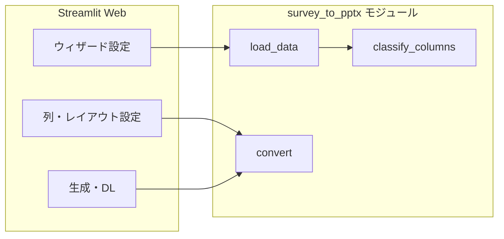

# 機能設計書

## 1. システム構成

- **UI**: `app.py`（Streamlit）
- **変換エンジン**: `survey_to_pptx.py`（pandas / python-pptx）
- **テンプレート**: `template/*.pptx`

## 2. 画面・操作フロー（Web）

### 2.1 ログイン

| 操作 | 振る舞い |
|------|----------|
| パスワード入力・ログイン | `st.session_state.logged_in = True` |
| ログアウト | セッションを未ログインに戻す |

### 2.2 ウィザード（読み込み前）

| 手順 | 内容 |
|------|------|
| 1 | ファイル選択（アップロード）。変更時は読み込み済みフラグをリセット。 |
| 2 | テンプレート選択（`list_builtin_templates()` の一覧）。 |
| 3 | 出力パターン数（1〜8）。 |
| 4 | 納品形: パターン別 / 登壇者別 ZIP。 |
| 5 | CSV 文字コード（CSV 読み込み時のみ有効）。 |
| 6 | 「CSV / XLSX を読み込む」押下でバイト列・設定を `st.session_state` に保存し再描画。 |

読み込み後は、上記ウィジェットを再表示しない（設定変更は「設定をやり直す」で未読み込み状態に戻す）。

### 2.3 読み込み後（データ設定）

| ブロック | 内容 |
|----------|------|
| プレビュー | 先頭最大 50 行を `st.dataframe` で表示。 |
| 個人情報除外 | チェック時、列タイプ `personal` を multiselect のデフォルトから除外。 |
| パターン 1 本 | パターン名、タイトル、サブタイトル、出力ファイル名、列 multiselect、**列ごとのレイアウト selectbox**。 |
| パターン複数 | タブ「パターン 1…N」ごとに同様の入力。2 本目以降の列デフォルトは空（1 本目は全体デフォルト）。 |
| 登壇者別 | 登壇者数、各 expander で表示名、**使用パターン番号（1 始まり）**、タイトル/サブタイトル上書き、行フィルタ ON/OFF、フィルタ列・値、ZIP 内ファイル名。 |
| プリセット | パターン 1 の列・レイアウトの保存、JSON 入出力、読み込み時は存在列のみ適用。 |
| 監査ログ | セッション内リストの表示・クリア。 |

### 2.4 レイアウトキーと UI 表示

`survey_to_pptx.COLUMN_LAYOUT_CHOICES_UI` の (内部キー, 画面ラベル) に対応。

| 内部キー | 画面での意味 |
|----------|----------------|
| `auto` | 自動（列タイプと列インデックス規則に従う） |
| `selection_chart` | 棒グラフ＋円グラフ（選択肢集計） |
| `pie_only` | 円グラフのみ |
| `free_text_table` | 自由記述を表レイアウトで複数スライド |
| `appendix_list` | 一覧表（Appendix 向けスライド群） |

### 2.5 生成処理

**パターン・単体**

- 選択列だけの `DataFrame` を切り出し、`column_layout` を列名→キーの辞書で `convert(..., df=..., column_layout=...)` を呼ぶ。

**パターン・ZIP**

- 各パターンについて上記を一時ファイルに書き、`zipfile` で 1 つの ZIP に格納。

**登壇者別 ZIP**

- 各登壇者について: 行フィルタ適用 → 割当パターンの列で切り出し → `convert`。成功分のみ ZIP に追加。結果を `success`/`error` で表示。

### 2.6 補助ロジック（app.py）

| 関数 | 役割 |
|------|------|
| `_col_widget_hash` | 列名に依存する Streamlit ウィジェット key の衝突回避 |
| `_safe_pptx_filename` | ダウンロードファイル名の安全化 |
| `_apply_row_filter` | 文字列比較による行の部分集合 |
| `_run_convert_captured` | `convert` 実行中の `stdout` を文字列として回収（ログ表示用） |

## 3. 変換エンジン（survey_to_pptx）

### 3.1 データ読込

- `load_data(path, encoding)`: 拡張子で Excel / CSV を分岐。CSV は指定とフォールバック候補でエンコーディングを試行。

### 3.2 列タイプ分類

`classify_columns(df)` → 各列に対し `personal` / `metadata` / `appendix_company` / `categorical` / `high_cardinality` / `text` / `empty` などを付与。氏名・メール等のルールと値の分布で判定。

### 3.3 Appendix の遅延出力

- `appendix_company` かつレイアウトが `auto` または `appendix_list` の列は、メインループではスキップし、末尾の「Appendix」セクションで表スライドを追加。
- それ以外（例: `selection_chart`）はメインループで通常の質問スライドとして処理。

### 3.4 メインループ

- `df.columns` の順で走査（入力 subset の列順を保持）。
- `personal` / `metadata` / `empty` はスキップ。
- 各列について `_emit_question_slides` で `column_layout` と自動判定に応じスライドを追加。

### 3.5 テンプレート利用時

- テンプレ PPTX を開き、先頭 2 枚以外のサンプルスライドを削除。
- タイトル・サマリはテンプレ側の既存スライドをそのまま利用する動作（ログメッセージ参照）。

### 3.6 CLI

- `python survey_to_pptx.py <file> [-o] [--title] [--subtitle] [--encoding] [--template | --builtin-template]`
- `column_layout` は未指定（常に自動相当）。

## 4. 状態管理（Web）

| キー（例） | 内容 |
|------------|------|
| `logged_in` | ログイン済みか |
| `wizard_loaded` | データ読み込み済みか |
| `upload_bytes` / `upload_name` / `upload_suffix` | アップロード内容 |
| `wizard_encoding` / `wizard_num_patterns` / `wizard_delivery_mode` / `wizard_template` | 読み込み時点の設定 |
| `column_presets` | プリセット名 → `{ columns, layouts }` |
| `audit_log` | 生成履歴の辞書リスト |

## 5. エラー・境界

- パターンで列が 0 本: 生成ボタン無効または警告。
- 登壇者の行フィルタ結果 0 件: 当該分をスキップしエラー表示。
- プリセット適用: 現在の CSV に存在しない列は無視。

## 6. 改訂履歴

| 日付 | 版 | 内容 |
|------|-----|------|
| 2026-04-04 | 1.0 | 初版 |
