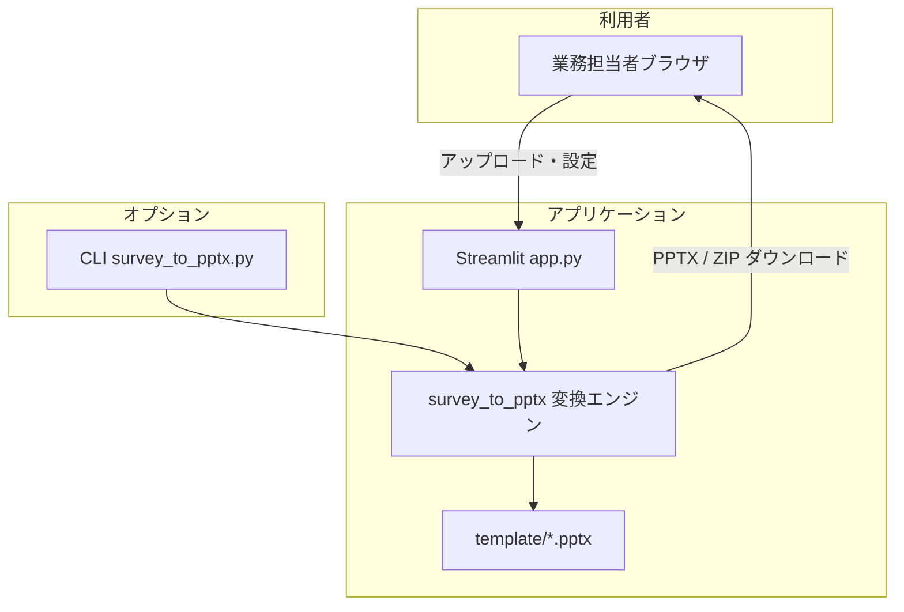

# 要件定義書

## ドキュメント管理

| 項目 | 内容 |
|------|------|
| システム名 | アンケート結果 → PowerPoint 変換ツール（survey_pptx） |
| 文書の目的 | 関係者間の合意形成用に、機能・非機能・スコープを定義する |
| 対象読者 | 企画・業務担当、開発・運用担当 |
| 参考 | ドキュメント構成の整理に [要件定義書テンプレート・要件定義書の書き方（Qiita）](https://qiita.com/syantien/items/9a8a7cbaeca2be3ef0d7) を参照 |

### バージョン履歴

| バージョン | 日付 | 変更内容 | 担当 |
|------------|------|----------|------|
| 1.1.0 | 2026-04-04 | Qiita 記事の構成に沿って全面改訂（5W1H、業務要件、画面・データ、非機能・セキュリティ・運用の整理） | — |
| 1.0.0 | 2026-04-04 | 初版（実装ベースの要件整理） | — |

---

## 1. 要件整理（5W1H）

| 5W1H | 本システムでの整理 |
|------|---------------------|
| **Who（誰が）** | 社内のイベント／セミナー運営担当、レポート作成担当。Web は共通パスワードで利用。**最終成果物の開示判断**（どの列を誰に渡すか）は業務側の責任。 |
| **What（何を）** | アップロードした CSV / Excel を設定に従い加工し、PowerPoint（1 本または ZIP）を生成するツール。CLI では単一ファイル変換。 |
| **When（いつ）** | イベント終了後、アンケート回収〜登壇者・協賛へのレポート納品までのタイミングで利用を想定。即時処理（対話的）。 |
| **Where（どこまで）** | **対象**: ブラウザ UI、ローカル／クラウド上の Streamlit 実行環境、テンプレ PPTX、変換モジュール。**対象外**: 恒久 DB、公開 HTTP API、個別ユーザー ID 管理。 |
| **Why（なぜ）** | 手作業の集計・スライド作成を減らし、**パターン別・登壇者別の開示差**を設定で再現可能にし、ミスと工数を削減する。 |
| **How（どうやって）** | Streamlit ＋ Python（pandas / python-pptx）。入力はファイルアップロード。認証は環境変数 `STREAMLIT_PASSWORD`。 |

---

## 2. ステークホルダー

| 役割 | 関心事 |
|------|--------|
| 業務担当（レポート作成） | 使いやすさ、開示ミスの防止、納品形式（単体 / ZIP） |
| 登壇者・協賛（エンド受領者） | 受け取る資料の内容（※本システムは直接利用しない） |
| 開発・保守 | 依存ライブラリ、デプロイ手順（`DEPLOY.md`）、再現性 |
| 情報管理／コンプライアンス | 個人情報の扱い、アップロードデータの取り扱い（サーバ保存なしの設計） |

---

## 3. 概要

### 3.A システム構成（論理）

- **外部 SaaS DB・他システム API との恒常連携はない**（要件として定義しない）。

### 3.B 背景と目的

| 観点 | 内容 |
|------|------|
| 現状の課題（例） | アンケート結果からスライドを手作業で作る時間がかかる。一般向けと協賛向けで載せる設問が違うため、**取り違えリスク**がある。 |
| 目的 | 同一アンケート CSV から、**テンプレ・列・レイアウト・行フィルタ**を組み合わせ、意図したとおりの PPTX を再現可能に生成する。 |
| ビジネス上の効果 | レポート準備のリードタイム短縮、開示範囲の設定による品質・説明責任の明確化（最終判断は業務）。 |

### 3.C 用語定義（Glossary）

| 用語 | 定義 |
|------|------|
| パターン | 出力 PPTX 1 本分の設定群（含める列、列ごとのレイアウト、表紙タイトル等、ファイル名）。最大 8。 |
| レイアウト | 列をスライド上でどう表現するか（自動、棒＋円、円のみ、自由記述テーブル、Appendix 一覧など）。 |
| 行フィルタ | 特定の列の値で回答行を絞り込むこと。登壇者別 ZIP でセッション単位の集計に利用。 |
| テンプレート | `template` 配下の PPTX。スライドマスタのレイアウトを変換処理が参照する。 |
| CLI | コマンドラインから `survey_to_pptx.py` を実行し、1 ファイル入出力する利用形態。 |

---

## 4. 業務要件

### 4.A 業務フロー（要約）

- **担当**: アンケート集計〜本ツール操作〜配布は業務担当（スイムレーン詳細は組織に依存）。

### 4.B 規模・想定スケール

| 項目 | 想定 |
|------|------|
| 同時利用者 | 社内少数（1〜数ユーザが順番に利用する想定） |
| 1 イベントあたり登壇者数 | 数名規模（UI 上 1〜8） |
| 出力パターン数 | 1〜8 |
| 入力データ | アンケート 1 ファイル／イベントを主眼（超大量バッチは CLI・分割運用を想定） |

### 4.C 時期・処理形態

- **オンライン対話型**: 画面操作のたびに読込・生成。バッチ夜間実行は CLI で別途運用可能。
- イベント単位で利用頻度が変動する。

### 4.D 評価指標（KPI）例

| 指標 | 例 |
|------|-----|
| レポート作成リードタイム | 手作業比で短縮（数値目標は組織で設定） |
| 意図しない開示 | パターン・列明示により削減（定性的監査にプリセット・ログを活用可能） |

### 4.E スコープ（業務境界）

| 対象内 | 対象外 |
|--------|--------|
| CSV/XLSX → PPTX（複数パターン／ZIP） | アンケート配信、回答収集そのもの |
| 列の型推定・個人情報らしさの UI 上の注意 | 法令に基づく正式な匿名化監査の代替 |
| プリセット JSON の import/export | クラウド上へのプリセット永久保存（未実装） |

---

## 5. 機能要件

### 5.A 機能一覧（ブレイクダウン）

| 大分類 | 中分類 | 小分類 / 内容 |
|--------|--------|----------------|
| 認証 | ログイン | 共通パスワード（環境変数）。未設定時は利用不可メッセージ。 |
| 認証 | ログアウト | セッションを終了。 |
| データ取込 | ウィザード | ファイル選択後、テンプレ・パターン数・納品形・文字コードを指定し、ボタンでパース開始（**読込前はプレビューしない**）。 |
| データ取込 | プレビュー | 読込後、表形式で先頭数十行を表示。 |
| 設定 | テンプレート | 内蔵 2 種類などから 1 つ選択（実装は存在ファイルに依存）。 |
| 設定 | パターン | 1〜8。各パターンで列・レイアウト・タイトル・ファイル名。 |
| 設定 | 列・レイアウト | 列 multiselect、列ごとにレイアウト指定。個人情報列の既定除外オプション。 |
| 出力 | パターン別 | 1 本は単体 DL、複数は ZIP。 |
| 出力 | 登壇者別 | 登壇者ごとにパターン番号・行フィルタ・ZIP 内ファイル名等、ZIP 一括 DL。 |
| 補助 | プリセット | パターン 1 相当の列・レイアウトの名前付き保存、JSON DL/UL。 |
| 補助 | 監査ログ | ブラウザセッション内の生成履歴表示・クリア。 |
| CLI | 変換 | 単一入力ファイル → 単一 PPTX、引数でテンプレ・タイトル等（列レイアウトの細指定なし）。 |

### 5.B 画面一覧と遷移（論理）

Streamlit の単一ページ構成。**表示ブロックの順序**で論理画面を定義する。

| 論理 ID | ブロック名 | 目的 |
|---------|------------|------|
| SCR-L | ログイン | パスワード認証。 |
| SCR-W0 | ウィザード（未読込） | アップロード、テンプレ・パターン数・納品・文字コード、読込ボタン。 |
| SCR-W1 | メイン（読込後） | プレビュー、列・レイアウト、パターンタブ、登壇者設定（モード時）、生成・DL。 |

- **遷移**: 未ログイン → SCR-L。ログイン済・未読込 → SCR-W0。読込後 → SCR-W1。「設定をやり直す」で SCR-W0 相当に戻る。

### 5.C 情報・データ・ログ

| 種別 | 内容 | 永続化 |
|------|------|--------|
| 入力 | CSV / XLSX（ブラウザ経由） | サーバにファイル保存しない設計（メモリ処理）。 |
| 出力 | PPTX / ZIP | ユーザー端末にダウンロード。 |
| セッション | ログイン状態、ウィザード状態、プリセット、監査ログ | ブラウザセッション／Streamlit セッション。 |
| ログ | 変換処理の標準出力キャプチャ（画面 expander） | 画面表示のみ。 |

- **永続 DB は用いない**（詳細は `DATABASE_DESIGN.md`）。

### 5.D 外部インターフェース

| 名称 | 接続先 | 目的 |
|------|--------|------|
| （HTTP API） | — | **提供しない**。 |
| 環境変数 | `STREAMLIT_PASSWORD` | Web ログイン用。 |
| ファイル | ユーザー作業ディレクトリ | CLI の入出力、プリセット JSON。 |

---

## 6. 非機能要件

### 6.A ユーザビリティ

- 読込前に「テンプレ・パターン・納品形」をまとめて選ばせ、**いきなり全データを見せない**ことで迷いを減らす。
- パターン複数時はタブで設定を分離。
- 個人情報列の既定除外で誤出力を抑止。

### 6.B システム方式（アーキテクチャ）

- Web: Streamlit。コアロジック: Python モジュール + python-pptx。
- デプロイ例: Streamlit Community Cloud（`DEPLOY.md`）。

### 6.C 規模・スケーラビリティ

- 同時多人数向けの水平スケールは要件としない。
- 入力が極大の場合は分割 CSV や CLI を想定。

### 6.D 性能

- **明示 SLA は設けない**。目安: 通常のアンケート件数・列数での対話的操作が実用的な時間で完了すること。

### 6.E 信頼性・可用性

- クラウド無料枠ではスリープ等あり得る（`DEPLOY.md` の注意事項）。
- 生成失敗時は画面上にエラーとログを表示。登壊者 ZIP は部分成功時も成功分を ZIP に含めうる。

### 6.F 拡張性

- レイアウト種別・テンプレ追加はコード／`template` 追加で拡張可能。
- HTTP API は将来別要件で検討。

### 6.G 互換性

- 入力: CSV（複数エンコーディング）、.xlsx。
- プリセット JSON のスキーマ変更時は `API_SPEC.md` / 実装と整合を取ること。

---

## 7. セキュリティ要件

### 7.A 情報セキュリティ

| 項目 | 方針 |
|------|------|
| 認証 | 単一共通パスワード。**多要素認証は要件外**。 |
| アンケート実データ | リポジトリに含めない。本番 URL のパスワードはシークレット管理。 |
| 通信 | ホスティング側の HTTPS に依存（例: Streamlit Cloud）。 |
| アクセス制御 | アプリ内ロール分けなし。URL・パスワードの運用で限定。 |

### 7.B 稼働環境

- 動作保証は「開発・検証で確認したブラウザ／Python バージョン」を前提とし、詳細は README／運用メモに従う。

### 7.C テスト・品質

- 機能テストは手動・短文の自動検証（convert 呼び出し等）を想定。**脆弱性診断を要件としない**（必要なら別プロジェクト）。

---

## 8. 移行要件

| 項目 | 内容 |
|------|------|
| 対象 | 手作業または Excel 直貼り等の既存レポート作成フローから、本ツールへの移行。 |
| 方針 | **ビッグバン**（イベント単位で切替）を想定。旧手順の並走期間は組織で決定。 |
| データ移行 | 既存 DB からの移行は**対象外**。アンケート CSV を都度アップロード。 |
| 検証 | 同一データでサンプル PPTX を比較し、開示列が業務期待と一致するか確認。 |

---

## 9. 運用要件

### 9.A 教育・ドキュメント

- `DEPLOY.md`（デプロイ）、本要件定義、`FUNCTIONAL_DESIGN.md`、`API_SPEC.md` を参照。
- 業務手順: ウィザードの順に操作する旨を社内マニュアル化推奨。

### 9.B 日常運用

- シークレット（`STREAMLIT_PASSWORD`）の変更・再デプロイ。
- テンプレ PPTX の差し替えはリポジトリまたは配置パス更新。

### 9.C 保守

- 依存パッケージの更新（`requirements.txt`）、Python / Streamlit の EOL に応じた更新。
- 監査ログはセッション内のみのため、**長期保存が必要なら別途エクスポート運用**を業務で定義。

---

## 10. 関連ドキュメント

| 文書 | 内容 |
|------|------|
| [FUNCTIONAL_DESIGN.md](./FUNCTIONAL_DESIGN.md) | 機能設計・処理フロー |
| [DATABASE_DESIGN.md](./DATABASE_DESIGN.md) | 永続化なし・論理データ |
| [API_SPEC.md](./API_SPEC.md) | CLI / Python API |
| [DEPLOY.md](../DEPLOY.md) | デプロイ手順 |

---

## 参考資料

- [要件定義書テンプレート・要件定義書の書き方（Qiita, @syantien）](https://qiita.com/syantien/items/9a8a7cbaeca2be3ef0d7)
